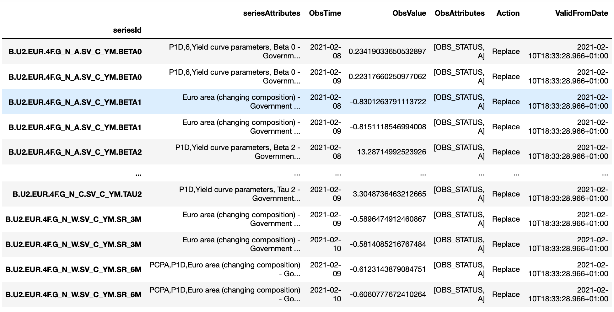

# SDMX Query Tool

# Abstract

The tool has been designed to use all the features of an SDMX API and to return a handy and simple `DataFrame` as a
result of the query. Very briefly, SDMX is a standard, based on XML, to share data and it was initially intended 
between Public Entities and later for a full data dissemination to the public audience (it reminds, a bit, how internet
started...). If you'd like more information on SDMX please feel free to visit the following links:

- [SDMX Official Page](https://sdmx.org)
- [ECB SDMX 2.1 RESTful web service](https://sdw-wsrest.ecb.europa.eu/help/)

## Installation

Once you have built the file, just run the `.whl` created file in the folder `dist`:

```commandline
pip install sdmx_query_tool-1.0.0-py3-none-any.whl
```

## Basic Usage

The tool has been designed to allow:
- Flexibility of sources: each source has a different module under the `sources` folder. All the logic and instructions
for a given source are then only stored in its module under this folder;
  
- Independence: since all the instructions for a given source lay only in their correspondent module, if one source gets
broken the whole package will keep running;
  
To call the package after installing it you can run the following command:

```python
from sdmx_query_tool import SDMXQueryTool

SDMXQueryTool.get_help()
```

This command will print the help pages for the source implemented within the package in order for you to see which
query parameters have been implemented in each source and to check for any other related information.

Once you have familiarized yourself with the source and the parameters you need to use in your query, we can now see a
practical example.

Let's say we'd like to get some data regarding the Yield Curves published by the ECB. We'd like to get only the latest
observation for each series as the dataset is very big. In order to satisfy our requirements we first see which 
parameters are available for the ECB:

```python
from sdmx_query_tool import SDMXQueryTool

SDMXQueryTool().ecb().available_parameters()
```

This will yield:

```
['start_period',
 'end_period',
 'last_n_observations',
 'first_n_observations',
 'detail',
 'updated_after',
 'include_history']
```

We will then choose `last_n_observations` as optional parameter and the query will be:

```python
from sdmx_query_tool import SDMXQueryTool

yc = SDMXQueryTool().ecb().retrieve_data()("YC", {"last_n_observations": "2"})
```

We will receive an output similar to this:



Obviously, since the output is a `pandas.DataFrame` we can leverage that to convert the file in any of the supported 
formats, like `.csv`, `.xlsx` or JSON:

```python
from sdmx_query_tool import SDMXQueryTool

yc = SDMXQueryTool().ecb().retrieve_data()("YC", {"last_n_observations": "2"})

yc.to_csv("ecb_yc_data_flow.csv")
```

Feel free to explore the sources with all the other available methods. Functions to pull up the code lists for the
source or a single data flow have been implemented.

# Feedback

I would appreciate any feedback/suggestion. You can use the tools available in GitHub or send me an email should you 
wish to. I'd be happy to hear from you!